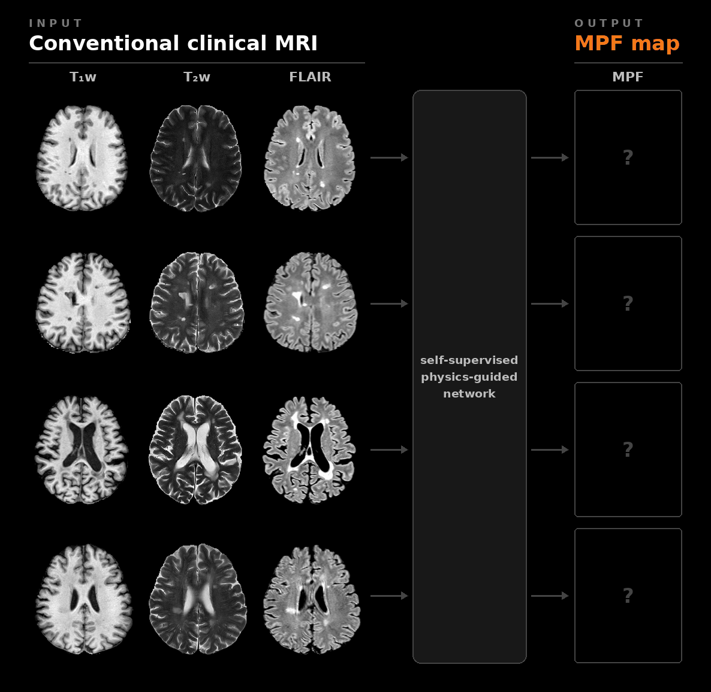

# Retrospective Macromolecular Pool Fraction Mapping from Conventional Clinical MRI

This repository contains the implementation of the paper: **"Retrospective macromolecular pool fraction mapping from conventional clinical MRI: a physics-guided self-supervised deep learning framework"**.

It extends our earlier framework for T1, T2 and PD mapping from conventional MRI ([Quantitative-mapping-from-conventional-MRI](https://github.com/JelmervanL/Quantitative-mapping-from-conventional-MRI)).

<p align="center">
  
</p>

## 📋 Abstract

Macromolecular pool fraction (MPF) is a quantitative imaging biomarker sensitive to myelin integrity, but its dependence on specialized acquisitions and reconstruction methods limits its availability for large-scale studies. We present a physics-guided, self-supervised deep learning framework for retrospectively estimating MPF directly from conventional multicontrast clinical brain MRI (T1-weighted, T2-weighted, and fluid-attenuated inversion recovery [FLAIR]), without paired quantitative reference scans. The framework embeds an analytical two-pool magnetization transfer signal model relating sequence-averaged radiofrequency transmit power to apparent longitudinal relaxation. To accommodate heterogeneous clinical protocols, the network conditions intermediate feature representations on acquisition parameters via adaptive instance normalization. The framework was trained and evaluated on a multisite, multivendor, multiprotocol dataset comprising 7,705 MRI sessions (3 T) from 4,489 subjects across Philips and Siemens systems. Across 1,237 test sessions, mean MPF was 0.182 ± 0.007 in white matter and 0.144 ± 0.009 in gray matter, with limited variation across vendor-by-protocol groups (between-group coefficient of variation: 2.65% in white matter and 5.63% in gray matter). In 70 sessions with demyelinating-disease labels, MPF was 36.2% lower in segmented lesions than in normal-appearing white matter. As a technical demonstration, MPF maps from two different clinical protocols acquired in a healthy volunteer showed a mean absolute percentage difference of 7.7% and a concordance correlation coefficient of 0.888, showing good protocol-agnostic consistency. These results suggest that magnetization transfer-informed self-supervised learning enables stable retrospective estimation of MPF maps from conventional clinical MRI, providing a scalable approach for investigating demyelinating pathology in existing imaging archives.

## 🛠️ Installation

This project is managed with **[uv](https://github.com/astral-sh/uv)**. Configuration uses **[Hydra](https://hydra.cc)**, and **[Weights & Biases (wandb)](https://wandb.ai/)** can optionally be used for experiment tracking.

### Prerequisites

  * Python 3.11
  * [uv](https://github.com/astral-sh/uv) installed
  * A CUDA GPU for training (inference also runs on a CPU, slowly)

### Setup

1.  **Clone the repository:**

    ```bash
    git clone <repository-url>
    cd <repository-name>
    ```

2.  **Initialize environment and install dependencies:**

    ```bash
    # install dependencies from pyproject.toml with uv
    uv sync
    ```

Dependency versions are pinned to the environment that produced the published results (PyTorch 2.1.2, TorchIO 0.20.6). Run the commands below from the repository root with `uv run python ...`, or activate the environment first (`source .venv/bin/activate`).

-----

## 📂 Project Structure

```text
.
├── checkpoints/trained_model/   # Put the downloaded pre-trained weights here (see "Inference / Testing")
├── configs/                     # Hydra configuration files
│   ├── train.yaml               # Training config (composes the groups below)
│   ├── test.yaml                # Inference config
│   ├── paths/default.yaml       # Dataset folders and CSV names, pre-trained model and output folders
│   ├── data/clinical.yaml       # Datasets used for training, batch size, preprocessing cache
│   ├── model/                   # Network with (adain.yaml) or without (no_adain.yaml) AdaIN
│   ├── physics/teixeira.yaml    # MT parameters, output ranges, WM reference values
│   ├── loss/default.yaml        # L1 data term, PD constraint, WM T1f prior, rescaling bound
│   ├── optim/adam.yaml          # Optimizer settings
│   ├── test_set/                # Test sets: umcu.yaml, mrrate.yaml
│   ├── checkpoint/              # Evaluate the pre-trained (paper.yaml) or your own (trained.yaml) model
│   └── experiment/
│       ├── full_model.yaml      # Proposed model (with AdaIN)
│       └── no_adain.yaml        # Same model without AdaIN
├── qmap/                        # Main source code package
│   ├── data/
│   │   ├── dataset.py           # CSV + NIfTI -> preprocessed sessions (TorchIO), rescaling anchor
│   │   └── transforms.py        # Crop/pad, slice removal, intensity normalization
│   ├── models/
│   │   ├── networks.py          # Shared-encoder attention U-Net, with or without AdaIN
│   │   ├── physics.py           # Two-pool apparent T1 and Bloch signal models
│   │   ├── losses.py
│   │   └── qmap_model.py        # Network -> q-maps -> synthetic contrasts -> loss
│   ├── evaluation/              # Slice-wise inference, tissue statistics, figures
│   ├── training.py              # Training loop
│   └── testing.py               # Inference on a test set
├── scripts/
│   ├── run_full_model.sh        # Train and test the proposed model
│   └── build_cache.py           # Pre-build the preprocessing cache (optional)
├── pyproject.toml               # Project configuration and dependencies
├── train.py                     # Main entry point for training
├── test.py                      # Main entry point for inference
└── uv.lock                      # uv lockfile for reproducible environments
```

-----

## 🧠 Models

A U-Net with a shared encoder takes the T1w, T2w and FLAIR images of a session and predicts four maps: proton density (PD), free-pool T1 (T1f), free-pool T2 (T2f) and the MPF (m0s). An MT-informed Bloch signal model synthesizes the three input contrasts from these maps with each sequence's parameters (TR, TE, TI, flip angle and sequence-averaged B1rms). The loss compares the synthetic contrasts with the real ones. No quantitative reference maps are used.

| model | experiment config | description |
|---|---|---|
| Proposed model | `full_model` | The network is conditioned on the acquisition parameters of each contrast with adaptive instance normalization (AdaIN). |
| Without AdaIN | `no_adain` | The same model without the acquisition conditioning (supplementary comparison in the paper). |

Both models are trained with an L1 data-consistency loss, a PD constraint and a Gaussian prior on white-matter T1f, and use a ±20 % bound on the rescaling of the synthetic contrasts.

-----

## 🏃 Usage

### 1\. Data Preparation

#### MRI Preprocessing

The model expects preprocessed NIfTI files. Per the paper's methodology:

1.  **Convert** DICOM to NIfTI (e.g., using `dcm2niix`).
2.  **Resample** the 2D T2w to $1 \times 1 \text{ mm}^2$ in-plane resolution.
3.  **Register** T1w and FLAIR to the T2w space (rigid registration, ANTsPy).
4.  **Skull-strip** (HD-BET) and apply **N4 bias field correction**.
5.  **Segment** brain, WM, GM, CSF and ventricle masks (SynthSeg).
6.  Optional, for the lesion analysis only: **WMH lesion masks** (LST-AI).

Cropping or padding to 224 × 224, removal of the edge slices, and intensity normalization by the histogram mode inside the WM are part of this code.

#### CSV Configuration

Each dataset needs one CSV per split (train/val/test) with one row per scan session. The sequence parameters in these CSVs are required for the Bloch signal model.

Required CSV columns:

  * **Session ID:** `ID` (used in the image and mask file names), `Manufacturer`
  * **Sequence parameters**, for each contrast `c` in `T1w`, `T2w`, `FLAIR`:
      * `c_seq_type`: `TFE`/`GRE` (spoiled gradient echo) or `MPRAGE` for T1w, `TSE` for T2w, `IR` for FLAIR
      * `c_TR` (Repetition Time, ms), `c_TE` (Echo Time, ms), `c_FA` (Flip Angle, degrees)
      * `c_B1rms`: sequence-averaged B1rms (µT)
      * `T1w_TI` and `FLAIR_TI` (Inversion Time, ms; empty for spoiled gradient echo)
  * **Effective TSE echo times:** `T2w_TEeff` and `FLAIR_TEeff`, or the factors `T2w_TEfactor` and `FLAIR_TEfactor` (see Supplementary Section C of the paper). Without these, fixed Philips factors are used (T2w: 0.9; FLAIR: 0.42, or 0.89 when TE < 200 ms).
  * Optional, for the lesion analysis only: `pathology`, `is_MS`

The reference rescaling factor of each contrast is computed from these parameters, so it does not have to be in the CSV.

#### File Structure Input Data

```text
<dataset root>/
├── images_stripped/
│   ├── <ID>_FLAIR.nii.gz
│   ├── <ID>_T1w.nii.gz
│   └── <ID>_T2w.nii.gz
├── masks_tissue/
│   ├── <ID>_brain.nii.gz
│   ├── <ID>_csf.nii.gz
│   ├── <ID>_gm.nii.gz
│   ├── <ID>_ventricles.nii.gz
│   └── <ID>_wm.nii.gz
├── masks_wmh/                       # optional, lesion analysis only
│   └── <ID>_wmh.nii.gz
├── preprocessed_cache/              # created automatically (see below)
├── train<csv_suffix>
├── val<csv_suffix>
└── test<csv_suffix>
```

#### Dataset Location

The dataset folders and CSV names are defined in `configs/paths/default.yaml`, relative to a data root folder:

| dataset | folder | CSV names |
|---|---|---|
| UMCU | `<data root>/UMCU` | `{train,val,test}.csv` |
| MR-RATE | `<data root>/MR-RATE` | `{train,val,test}.csv` |

Set the data root with an environment variable (default: `data/` in the repository):

```bash
export QMAP_DATA_ROOT=/path/to/datasets
```

The first time a session is loaded, its preprocessed volumes are written to `<dataset root>/preprocessed_cache/`. Later epochs and runs read them from there. You can build this cache in advance with `scripts/build_cache.py`, but you don't have to.

> **Note:** The UMCU data cannot be made public due to privacy regulations. The MR-RATE dataset is available from [Hugging Face](https://huggingface.co/datasets/Forithmus/MR-RATE) under its access conditions. To use your own data, add an entry to `configs/paths/default.yaml` and select it with `data.datasets` (training) or a test set in `configs/test_set/`.

### 2\. Training

`scripts/run_full_model.sh` trains the proposed model and then tests it on the UMCU and MR-RATE test sets:

```bash
scripts/run_full_model.sh train
```

To train a single model:

```bash
uv run python train.py experiment=full_model      # proposed model (with AdaIN)
uv run python train.py experiment=no_adain        # without AdaIN
```

A run is written to `outputs/<experiment name>/`:

  * `<epoch>_net_G.pth` and `latest_net_G.pth`: the model weights after each epoch
  * `.hydra/`: the full config of the run
  * `metrics.jsonl`: training metrics and, after each epoch, validation metrics on the clinical validation set

Any config value can be changed on the command line. Some examples:

```bash
uv run python train.py experiment=full_model logging.wandb=true                  # log to wandb
uv run python train.py experiment=full_model data.max_sessions.train=20 \
    train.epochs=1 train.warmup.iters=10                                          # quick test run
uv run python train.py experiment=full_model --cfg job                           # print the config
```

Training takes about 5 hours per model on an RTX 4500 Ada GPU. GPU training is not bit-reproducible by default; with `deterministic=true` (slower), runs with the same seed give identical results.

### 3\. Inference / Testing

1.  **Download Weights:** Download the pre-trained weights of the proposed model from the **Releases** page.
2.  **Place Weights:** Put the downloaded file in `checkpoints/trained_model/latest_net_G.pth`.
3.  **Run Inference:**

<!-- end list -->

```bash
# the published proposed model on both test sets
scripts/run_full_model.sh paper

# or one model and test set at a time (test_set: umcu or mrrate)
uv run python test.py experiment=full_model test_set=umcu checkpoint=paper     # pre-trained weights
uv run python test.py experiment=full_model test_set=mrrate                      # your own run in outputs/
uv run python test.py experiment=no_adain test_set=umcu                          # your own run without AdaIN
```

The results are saved in the checkpoint folder (`checkpoints/trained_model/` or `outputs/<experiment name>/`), in `test_umcu/` or `test_mrrate/`:

  * `niftis/<ID>/<ID>_{qPD,qT1_free,qT2,qM0s}.nii.gz`: the quantitative maps. T1f and T2f are in ms, and `qM0s` is the MPF (m0s).
  * `niftis/<ID>/`: also the synthetic and real input images and the WM/GM masks used for the statistics
  * `output_figures/`: one figure per session with the input, synthetic and quantitative images
  * `test_metrics_subjects.csv`: image-consistency metrics per session
  * `test_qstar_values_subjects.csv`: mean and SD of each map in WM and GM, excluding lesions
  * `wmh_qstar_values_subjects.csv`: map statistics inside WMH lesions

-----

## 📄 License

This project is licensed under a **Creative Commons Attribution-NonCommercial (CC BY-NC)** license.
